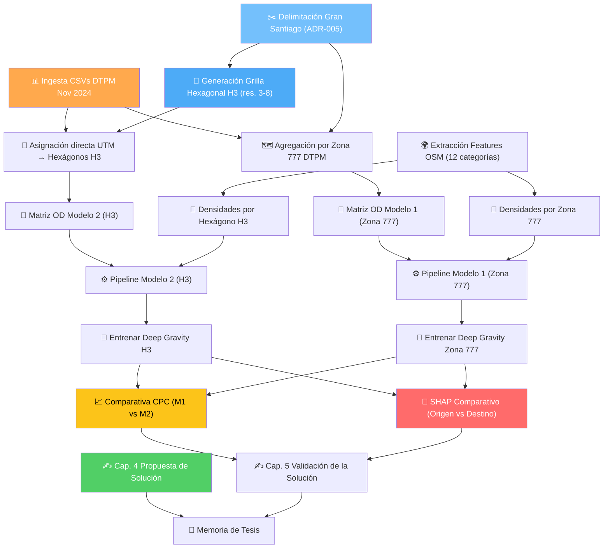

# Análisis del Proyecto Deep Gravity — Estado y Pasos a Seguir

> **Última actualización:** 2 de septiembre de 2026

---

## Estado General del Proyecto

```
Fase 1: Reproducción del paper (New York)           ✅ COMPLETADA (CPC = 0.5119)
Fase 2: Redacción de la tesis                       🔄 EN PROGRESO (5/6 capítulos maduros)
Fase 3: Obtención y procesamiento datos Santiago     🔄 EN PROGRESO (datos disponibles, decisiones metodológicas tomadas — ADR-004/005)
Fase 4: Adaptación del modelo a Santiago             ❌ PENDIENTE (estrategia doble modelo: Zona 777 control vs. Grilla Hexagonal H3)
Fase 5: Evaluación comparativa + XAI                ❌ PENDIENTE (evaluación CPC y SHAP comparado entre modelos)
```

---

## ✅ Lo que ya está hecho

### Código y Experimentos

| Componente | Estado | Ubicación |
|---|---|---|
| **Reproducción NY (Fase 1)** | ✅ CPC = 0.5119 | [`REPORTE_REPRODUCCION_NEWYORK.md`](file:///c:/Users/pablo/Documents/070.- MEMORIA DE PABLO CAMPOS/Modelo_Deep_Gravity/DeepGravity/docs/experimentos/REPORTE_REPRODUCCION_NEWYORK.md) |
| **Modelo Deep Gravity** | ✅ 15 capas FF, PyTorch | [`deepgravity.py`](file:///c:/Users/pablo/Documents/070.- MEMORIA DE PABLO CAMPOS/Modelo_Deep_Gravity/DeepGravity/deepgravity/models/deepgravity.py) |
| **Baselines** | ✅ Gravedad + Radiación | [`models/`](file:///c:/Users/pablo/Documents/070.- MEMORIA DE PABLO CAMPOS/Modelo_Deep_Gravity/DeepGravity/deepgravity/models) |
| **Pipeline entrenamiento** | ✅ CLI, train, eval, export | [`main.py`](file:///c:/Users/pablo/Documents/070.- MEMORIA DE PABLO CAMPOS/Modelo_Deep_Gravity/DeepGravity/deepgravity/main.py) |
| **Resultados NY** | ✅ Checkpoint + CPC por tile | [`results/`](file:///c:/Users/pablo/Documents/070.- MEMORIA DE PABLO CAMPOS/Modelo_Deep_Gravity/DeepGravity/deepgravity/results) |

### Documentación Técnica

| Documento | Estado | Ubicación |
|---|---|---|
| **Auditoría del código original** | ✅ Refactorizado con disclaimer | [`architecture.md`](file:///c:/Users/pablo/Documents/070.- MEMORIA DE PABLO CAMPOS/Modelo_Deep_Gravity/DeepGravity/docs/architecture.md) |
| **Arquitectura Santiago** | ✅ Pipeline con doble modelo (H3 + Zona 777) y OSM | [`arquitectura_santiago.md`](file:///c:/Users/pablo/Documents/070.- MEMORIA DE PABLO CAMPOS/Modelo_Deep_Gravity/DeepGravity/docs/arquitectura_santiago.md) |
| **Alcance y objetivos** | ✅ Formalizados y actualizados (ago. 2026) | [`ALCANCE_Y_LINEAMIENTOS_TESIS.md`](file:///c:/Users/pablo/Documents/070.- MEMORIA DE PABLO CAMPOS/Modelo_Deep_Gravity/DeepGravity/docs/contexto/ALCANCE_Y_LINEAMIENTOS_TESIS.md) |
| **ADRs (5 decisiones)** | ✅ Dataset DTPM, H3 + doble modelo, delimitación Stgo | [`adr/`](file:///c:/Users/pablo/Documents/070.- MEMORIA DE PABLO CAMPOS/Modelo_Deep_Gravity/DeepGravity/docs/adr) |
| **Transcripción Reunión Guía** | ✅ Resumen y acuerdos reunión 31 ago 2026 | [`Transcripcion_Reunion_31ago2026_Profesora_Guia.md`](file:///c:/Users/pablo/Documents/070.- MEMORIA DE PABLO CAMPOS/Modelo_Deep_Gravity/Transcripcion_Reunion_31ago2026_Profesora_Guia.md) |
| **Hallazgos técnicos** | ✅ Bugs, notas DTPM, bibliografía | [`conocimiento/hallazgos_tecnicos.md`](file:///c:/Users/pablo/Documents/070.- MEMORIA DE PABLO CAMPOS/Modelo_Deep_Gravity/DeepGravity/docs/conocimiento/hallazgos_tecnicos.md) |

### Tesis LaTeX (tex-thesis-template)

| Capítulo | Archivo | Estado |
|---|---|---|
| Introducción | [`introduccion.tex`](file:///c:/Users/pablo/Documents/070.- MEMORIA DE PABLO CAMPOS/Modelo_Deep_Gravity/tex-thesis-template/introduccion.tex) | ✅ Completa |
| Cap. 1 — Definición del Problema | [`definicion_del_problema.tex`](file:///c:/Users/pablo/Documents/070.- MEMORIA DE PABLO CAMPOS/Modelo_Deep_Gravity/tex-thesis-template/definicion_del_problema.tex) | ✅ Completa |
| Cap. 2 — Marco Conceptual | [`marco_conceptual.tex`](file:///c:/Users/pablo/Documents/070.- MEMORIA DE PABLO CAMPOS/Modelo_Deep_Gravity/tex-thesis-template/marco_conceptual.tex) | ✅ Completa (7 secciones, ecuaciones numeradas) |
| Cap. 3 — Trabajo Relacionado | [`trabajo_relacionado.tex`](file:///c:/Users/pablo/Documents/070.- MEMORIA DE PABLO CAMPOS/Modelo_Deep_Gravity/tex-thesis-template/trabajo_relacionado.tex) | ✅ Completa (6 secciones, compilada) |
| Cap. 4 — Propuesta de Solución | [`propuesta_de_solucion.tex`](file:///c:/Users/pablo/Documents/070.- MEMORIA DE PABLO CAMPOS/Modelo_Deep_Gravity/tex-thesis-template/propuesta_de_solucion.tex) | ✅ Completa (Doble modelo y XAI) |
| Cap. 5 — Validación de la Solución | [`validacion_de_la_solucion.tex`](file:///c:/Users/pablo/Documents/070.- MEMORIA DE PABLO CAMPOS/Modelo_Deep_Gravity/tex-thesis-template/validacion_de_la_solucion.tex) | ⏳ Estructurada (espera resultados) |
| Conclusiones | [`conclusiones.tex`](file:///c:/Users/pablo/Documents/070.- MEMORIA DE PABLO CAMPOS/Modelo_Deep_Gravity/tex-thesis-template/conclusiones.tex) | ❌ Placeholder |

> [!TIP]
> **Revisiones aplicadas (1-2 sep. 2026):** Se redactó íntegramente el Capítulo 4 (Propuesta de Solución), estructurando el pipeline metodológico y la arquitectura dual. Se estructuró en comentarios el Capítulo 5 con las instrucciones de redacción guiadas por Lenormand et al. Se corrigió el OE-2 y se agregaron 10 nuevas referencias bibliográficas.
>
> **Revisiones previas (29 ago. 2026):** Se completaron 22 tareas de corrección profunda. Se expandió la justificación del contexto latinoamericano, se eliminaron plantillas residuales, se mejoraron las tablas con `booktabs`, y se integraron 6 referencias de alto impacto (Vecchio, Marín-Flores, Herfort, Spadon, Brockmann, DTPM 2025).
> 
> **Revisiones preliminares (23 ago. 2026):** Se resolvieron observaciones en los capítulos iniciales (corrección de cita DTPM preliminar, síntesis de overlap sobre EOD/bip! en Marco Conceptual, y ajuste de Introducción).

> [!NOTE]
> El archivo [`main.tex`](file:///c:/Users/pablo/Documents/070.- MEMORIA DE PABLO CAMPOS/Modelo_Deep_Gravity/tex-thesis-template/main.tex) ya incluye los `\input{}` de todos los capítulos. Orden de compilación: introducción → definición del problema → marco conceptual → trabajo relacionado → propuesta → validación → conclusiones → anexos → bibliografía.

#### Detalle de secciones por capítulo

**Cap. 2 — Marco Conceptual** (7 secciones):
- §2.1 Movilidad urbana y flujos origen-destino
- §2.2 Modelos clásicos de generación de flujos
  - §2.2.1 Modelo gravitatorio
  - §2.2.2 Modelo de oportunidades intervinientes *(ampliado 22 ago. 2026: ecuación formal $P_{ij}$, definiciones $m_l$, $s_{ij}$, $S_{ij}$, $z \sim p(z)$)*
  - §2.2.3 Modelo de radiación *(ampliado 22 ago. 2026: variantes Ren 2014 / Kang 2015 / Yang 2014 + limitación intraurbana)*
- §2.3 Aprendizaje profundo aplicado a la movilidad
- §2.4 Deep Gravity
- §2.5 Explicabilidad en IA (XAI)
- §2.6 OpenStreetMap como fuente de datos geoespaciales
- §2.7 Contexto de la movilidad en Santiago de Chile

**Cap. 3 — Trabajo Relacionado** (6 secciones):
- §3.1 Descubrimiento de patrones en la movilidad individual
- §3.2 Unificación de modelos clásicos y enfoques continuos
- §3.3 Evolución de los modelos de oportunidades intervinientes *(nueva, 22 ago. 2026)*
  - §3.3.1 Modelo PWO — Yan et al. (2014)
  - §3.3.2 Modelos exploratorios — Sim et al. (2015), Liu & Yan (2019)
  - §3.3.3 Modelo Unificado de Oportunidades — Liu & Yan (2020)
- §3.4 Deep Learning y modelos espacio-temporales en movilidad
- §3.5 Generación de flujos mediante datos no convencionales
- §3.6 En Resumen *(actualizado: referencia §3.3 en el trade-off)*

### Bibliografía

El archivo [`bibliografia.bib`](file:///c:/Users/pablo/Documents/070.- MEMORIA DE PABLO CAMPOS/Modelo_Deep_Gravity/tex-thesis-template/bibliografia.bib) contiene **41 entradas para la memoria** (se integraron 10 nuevas referencias metodológicas el 1 de sep. 2026):

| Clave | Referencia | Usado en |
|---|---|---|
| `simini2021deep` | Simini et al. (2021) — Deep Gravity | Marco Conceptual, Trabajo Relacionado |
| `simini2012universal` | Simini et al. (2012) — Modelo Radiación | Marco Conceptual, Trabajo Relacionado |
| `liu2024interdisciplinary` | Rong, Ding & Li (2024) — Survey OD Flows | Marco Conceptual, Trabajo Relacionado |
| `lundberg2017shap` | Lundberg & Lee (2017) — SHAP | Marco Conceptual, Trabajo Relacionado |
| `zipf1946p` | Zipf (1946) — Hipótesis P1P2/D | Marco Conceptual, Trabajo Relacionado |
| `stouffer1940intervening` | Stouffer (1940) — Oportunidades Intervinientes | Marco Conceptual, Trabajo Relacionado |
| `pappalardo2023scikitmobility` | Pappalardo et al. (2023) — scikit-mobility | — |
| `openstreetmap` | OSM contributors (2017) | — |
| `dtpm_informe_2025` | DTPM (2025) — Informe institucional | Def. del Problema, Marco Conceptual |
| `BarringtonLeigh2017` | Barrington-Leigh & Millard-Ball (2017) — OSM coverage | Def. del Problema, Marco Conceptual |
| `haklay2008openstreetmap` | Haklay & Weber (2008) — OSM IEEE paper | Marco Conceptual |
| `sundararajan2017axiomatic` | Sundararajan et al. (2017) — Integrated Gradients | Marco Conceptual |
| `luca2024tsmob` | Luca et al. (2024) — TS-Mob | Marco Conceptual, Trabajo Relacionado |
| `gonzalez2008understanding` | González et al. (2008) — Patrones movilidad individual | Trabajo Relacionado |
| `simini2013human` | Simini, Maritan & Néda (2013) — Movilidad en continuo | Trabajo Relacionado |
| `rong2026satellites` | Rong et al. (2026) — GlODGen satelital | Trabajo Relacionado |
| `xu2025predicting` | Xu et al. (2025) — Imagery2Flow | Trabajo Relacionado |
| `liu2020intervening` | Liu & Yan (2020) — Review IO models, *Acta Phys. Sin.* | Cap. 2 §2.2.2–2.2.3, Cap. 3 §3.3 |
| `yan2014population` | Yan et al. (2014) — Modelo PWO, *J. R. Soc. Interface* | Cap. 2 §2.2.3, Cap. 3 §3.3 |
| `yan2017unified` | Yan et al. (2017) — Modelo individual+colectivo, *Nat. Commun.* | Cap. 3 §3.3 |
| `liu2019opportunity` | Liu & Yan (2019) — Opportunity Priority Selection, *Physica A* | Cap. 3 §3.3 |
| `sim2015deliberate` | Sim et al. (2015) — Deliberate Social Selection, *J. R. Soc. Interface* | Cap. 3 §3.3 |
| `ren2014predicting` | Ren et al. (2014) — Radiation por tiempo de viaje, *Nat. Commun.* | Cap. 2 §2.2.3 |
| `kang2015generalized` | Kang et al. (2015) — Radiation generalizado, *PLOS ONE* | Cap. 2 §2.2.3 |
| `yang2014limits` | Yang et al. (2014) — Predictibilidad en movilidad, *Sci. Rep.* | Cap. 2 §2.2.3 |
| `brockmann2006scaling` | Brockmann et al. (2006) — The scaling laws of human travel | Trabajo Relacionado §3.1 |
| `vecchio2020transport` | Vecchio et al. (2020) — Accesibilidad y equidad LatAm | Def. del Problema §1.3 |
| `marinflores2026proximity` | Marín-Flores et al. (2026) — Desigualdad commuting Stgo | Def. del Problema §1.3 |
| `herfort2023spatio` | Herfort et al. (2023) — Completitud global OSM | Def. del Problema §1.3 |
| `spadon2019reconstructing` | Spadon et al. (2019) — Commuting networks LatAm | Trabajo Relacionado §3.4 |
| **10 Nuevas (1 sep 26)** | Munizaga, Espinoza, Graells-Garrido, Ortúzar, Hornik, McFadden, Wilson, Lenormand ×2, Brodsky | Capítulos 4 y 5 |

### Fuentes Bibliográficas (14 archivos en markdown + PDF)

| Paper / Documento | Clave bib | Archivo |
|---|---|---|
| Zipf (1946) | `zipf1946p` | [`Zipf-P1P2DHypothesis-1946.md`](file:///c:/Users/pablo/Documents/070.- MEMORIA DE PABLO CAMPOS/Modelo_Deep_Gravity/Fuentes/markdown/Zipf-P1P2DHypothesis-1946.md) |
| Stouffer (1940) | `stouffer1940intervening` | [`Stouffer-InterveningOpportunitiesTheory-1940.md`](file:///c:/Users/pablo/Documents/070.- MEMORIA DE PABLO CAMPOS/Modelo_Deep_Gravity/Fuentes/markdown/Stouffer-InterveningOpportunitiesTheory-1940.md) |
| Simini et al. (2012) — Radiación | `simini2012universal` | [`A universal model for mobility and migration patterns.md`](file:///c:/Users/pablo/Documents/070.- MEMORIA DE PABLO CAMPOS/Modelo_Deep_Gravity/Fuentes/markdown/A%20universal%20model%20for%20mobility%20and%20migration%20patterns.md) |
| Simini et al. (2021) — Deep Gravity | `simini2021deep` | [`A Deep Gravity model for mobility flows generation.md`](file:///c:/Users/pablo/Documents/070.- MEMORIA DE PABLO CAMPOS/Modelo_Deep_Gravity/Fuentes/markdown/A%20Deep%20Gravity%20model%20for%20mobility%20flows%20generation.md) |
| Rong, Ding & Li (2024) — Survey OD | `liu2024interdisciplinary` | [`An Interdisciplinary Survey on Origin-destination Flows Modeling.md`](file:///c:/Users/pablo/Documents/070.- MEMORIA DE PABLO CAMPOS/Modelo_Deep_Gravity/Fuentes/markdown/An%20Interdisciplinary%20Survey%20on%20Origin-destination%20Flows%20Modeling%20-%20Theory%20and%20Techniques.md) |
| Luca et al. (2024) — TS-Mob | `luca2024tsmob` | [`TS-Mob-Social and Geographical-Aware Time Series.md`](file:///c:/Users/pablo/Documents/070.- MEMORIA DE PABLO CAMPOS/Modelo_Deep_Gravity/Fuentes/markdown/TS-Mob-Social%20and%20Geographical-Aware%20Time%20Series.md) |
| González et al. (2008) | `gonzalez2008understanding` | [`Understanding individual human mobility patterns.md`](file:///c:/Users/pablo/Documents/070.- MEMORIA DE PABLO CAMPOS/Modelo_Deep_Gravity/Fuentes/markdown/Understanding%20individual%20human%20mobility%20patterns.md) |
| Simini et al. (2013) — Continuo | `simini2013human` | [`Human Mobility in a Continuum Approach.md`](file:///c:/Users/pablo/Documents/070.- MEMORIA DE PABLO CAMPOS/Modelo_Deep_Gravity/Fuentes/markdown/Human%20Mobility%20in%20a%20Continuum%20Approach.md) |
| Rong et al. (2024) — GlODGen | `rong2024satellites` | [`Satellites Reveal Mobility.md`](file:///c:/Users/pablo/Documents/070.- MEMORIA DE PABLO CAMPOS/Modelo_Deep_Gravity/Fuentes/markdown/Satellites%20Reveal%20Mobility%20-%20A%20Commuting%20Origin-destination%20Flow%20Generator%20for%20Global%20Cities.md) |
| Xu et al. (2025) — Imagery2Flow | `xu2025predicting` | [`Predicting human mobility flows in cities using deep learning on satellite imagery.md`](file:///c:/Users/pablo/Documents/070.- MEMORIA DE PABLO CAMPOS/Modelo_Deep_Gravity/Fuentes/markdown/Predicting%20human%20mobility%20flows%20in%20cities%20using%20deep%20learning%20on%20satellite%20imagery.md) |
| **Liu & Yan (2020) — Review IO models** | `liu2020intervening` | [`Research advances in intervening opportunity class models for predicting human mobility.md`](file:///c:/Users/pablo/Documents/070.- MEMORIA DE PABLO CAMPOS/Modelo_Deep_Gravity/Fuentes/markdown/Research%20advances%20in%20intervening%20opportunity%20class%20models%20for%20predicting%20human%20mobility.md) |
| **Memoria Vicente Mackenzie (2026)** *(apoyo/control)* | — | [`Memoria_Vicente_NN_Civil_Informatica.md`](file:///c:/Users/pablo/Documents/070.- MEMORIA DE PABLO CAMPOS/Modelo_Deep_Gravity/Fuentes/markdown/Memoria_Vicente_NN_Civil_Informatica.md) |
| Memoria Angélica García | — | [`Memoria_Angélica_García_Civil_Informatica.md`](file:///c:/Users/pablo/Documents/070.- MEMORIA DE PABLO CAMPOS/Modelo_Deep_Gravity/Fuentes/markdown/Memoria_Ang%C3%A9lica_Garc%C3%ADa_Civil_Informatica.md) |
| Memoria Gabriela Paz | — | [`Memoria_Gabriela_Paz_Ing_Civil_Informatica.md`](file:///c:/Users/pablo/Documents/070.- MEMORIA DE PABLO CAMPOS/Modelo_Deep_Gravity/Fuentes/markdown/Memoria_Gabriela_Paz_Ing_Civil_Informatica.md) |

> [!NOTE]
> Los papers de Yan et al. (2014), Yan et al. (2017), Liu & Yan (2019), Sim et al. (2015), Ren et al. (2014), Kang et al. (2015) y Yang et al. (2014) están en `bibliografia.bib` pero **no tienen archivo .md/PDF local** en `Fuentes/`. Sus referencias completas se acceden vía DOI desde `bibliografia.bib`.

### Datos DTPM

> [!NOTE]
> **Los datos del DTPM son de Noviembre 2024** (validaciones bip!/Red), **NO** de la EOD 2012.
> - `2024-11-27.etapas.csv`: **1.5 millones** de etapas (35 cols, 440 MB)
> - `2024-11-27.viajes.csv`: **3.6 millones** de viajes (100 cols, 1.5 GB)
> - **Soporte espacial dual:** Contienen coordenadas UTM (`x_subida`, `y_subida`, `x_bajada`, `y_bajada`) que permiten asignar viajes directamente a celdas hexagonales H3 (Modelo 2) sin pasar por agregación intermedia, así como identificadores de zona (`zona_subida`, `zona_bajada`) para el Modelo 1 (Teselación 777 control).
> - **Delimitación geográfica:** Acotado al Gran Santiago urbano según [ADR-005](./DeepGravity/docs/adr/ADR-005-delimitacion-gran-santiago.md) para filtrar zonas periféricas/rurales sin cobertura densa.
> - Los CSV completos están en el equipo del usuario (no en el repo). En [`Fuentes/dptm/`](file:///c:/Users/pablo/Documents/070.- MEMORIA DE PABLO CAMPOS/Modelo_Deep_Gravity/Fuentes/dptm) se encuentran resúmenes y el diccionario de campos.

---

## ⚠️ Lo que falta

### Redacción de la Tesis

| Capítulo | Dependencia |
|---|---|
| **Cap. 4 — Propuesta de Solución** | ✅ Completado. Documentado el pipeline de doble modelo H3 y Zona 777. |
| **Cap. 5 — Validación de la Solución** | Estructurado. Requiere resultados experimentales comparativos (CPC y SHAP). |
| **Conclusiones** | Requiere validación completa y contraste con hallazgos de Vicente (2026). |

### Pipeline Técnico para Santiago

| Componente | Estado | Bloquea |
|---|---|---|
| **CSV completos del DTPM en ruta accesible** | ❓ Existen pero no integrados al repo | Todo lo técnico |
| **Tessellation Hexagonal H3 (res. 3–8)** | ⏳ Por generar con `h3-py` sobre Gran Santiago (ADR-005) | Asignación directa punto-hexágono |
| **Delimitación Gran Santiago (ADR-005)** | ⏳ Lista tentativa de ~33 comunas a validar con datos | Filtrado territorial de viajes |
| **Features OSM de Santiago (12 categorías)** | ❌ No extraídas | Entrenamiento |
| **Adaptación data_loader para DTPM dual** | ❌ Pendiente (soporte Zona 777 y Hexágonos H3) | Pipeline Santiago |
| **Corrección de bugs del código original** | ❌ Pendiente — ver [`hallazgos_tecnicos.md`](file:///c:/Users/pablo/Documents/070.- MEMORIA DE PABLO CAMPOS/Modelo_Deep_Gravity/DeepGravity/docs/conocimiento/hallazgos_tecnicos.md) | Ejecución del modelo |

> [!WARNING]
> **Bugs conocidos en el código** que deben corregirse antes de procesar Santiago:
> 1. [`utils.py:106`](file:///c:/Users/pablo/Documents/070.- MEMORIA DE PABLO CAMPOS/Modelo_Deep_Gravity/DeepGravity/deepgravity/utils.py#L106) — Bug de serialización: guarda `oa2centroid` en vez de `od2flow`
> 2. [`main.py`](file:///c:/Users/pablo/Documents/070.- MEMORIA DE PABLO CAMPOS/Modelo_Deep_Gravity/DeepGravity/deepgravity/main.py) — Imports con `SourceFileLoader` acoplan ejecución al CWD
> 3. `_compute_support_files` está **comentada** en `load_data()` — necesaria para generar caché de Santiago

---

## Próximos Pasos Recomendados

### Frente 1: Redacción de la Tesis (Estructuración y Avance)

1. **Cap. 4 — Propuesta de Solución:**
   - ✅ **Completado.** Se detalló el pipeline técnico integral: Ingesta DTPM $\rightarrow$ Delimitación Gran Santiago $\rightarrow$ Diseño experimental de **doble modelo**.
   - Se consolidaron los descriptores OSM en **12 macro-categorías funcionales**.
   - Se fundamentó teóricamente la arquitectura (Logit Multinomial, entropía, aproximación universal).

2. **Cap. 5 — Validación de la Solución (Metodología Experimental):**
   - ⏳ **Estructurado.** Listo para rellenar post-experimentos con:
   - Protocolo de evaluación comparativo multitemporal.
   - Métricas clave: CPC y análisis de esparsidad matricial (Lenormand et al.).
   - Diseño experimental de **explicabilidad comparativa con SHAP** para evaluar si la grilla H3 mitiga el sesgo de sobredependencia del origen.

### Frente 2: Pipeline de Datos de Santiago (11 Pasos)

| Paso | Descripción | Dependencia |
|---|---|---|
| **2.1** | Integrar CSV completos del DTPM (`viajes.csv`, `etapas.csv`) en ruta accesible | — |
| **2.2** | Corregir bugs en `utils.py` (serialización) y descomentar `_compute_support_files` | — |
| **2.3** | Generar tessellation hexagonal H3 (resoluciones 3 a 8 con `h3-py`) sobre bounding box | — |
| **2.3b** | Delimitar área de estudio al Gran Santiago urbano según [ADR-005](./DeepGravity/docs/adr/ADR-005-delimitacion-gran-santiago.md) (clip territorial) | 2.3 |
| **2.4** | Asignar viajes individuales directamente a hexágonos H3 vía UTM $\rightarrow$ Matriz OD Modelo 2 | 2.1, 2.3b |
| **2.4b** | Construir en paralelo la matriz OD por zonas 777 $\rightarrow$ Matriz OD Modelo 1 (Control) | 2.1, 2.3b |
| **2.4c** | *(Opcional)* Construir matriz OD a nivel comunal $\rightarrow$ Modelo 0 (Baseline) | 2.1 |
| **2.5** | Extraer features OSM y densificar en 12 macro-categorías por celda H3 y por zona 777 | 2.3b |
| **2.6** | Adaptar `data_loader.py` para soportar estructuras espaciales de ambos modelos | 2.4, 2.4b, 2.5 |
| **2.7** | Ejecutar preprocesamiento completo (`_compute_support_files`) para cada modelo | 2.6 |
| **2.8** | Entrenar Modelo 1 y Modelo 2 (por resolución H3), evaluar CPC y contrastar con baselines | 2.7 |
| **2.9** | Ejecutar análisis XAI con SHAP comparativo (evaluar balance origen vs. destino) | 2.8 |

### Decisiones Técnicas Tomadas (ADRs Registrados)

| ADR | Título | Estado | Detalle |
|---|---|---|---|
| [ADR-001](./DeepGravity/docs/adr/ADR-001-dataset-dtpm-nov2024.md) | Dataset DTPM Noviembre 2024 como Ground Truth | Aceptado | Fuente primaria masiva post-pandemia; coordenadas UTM para uso dual |
| [ADR-002](./DeepGravity/docs/adr/ADR-002-grilla-cuadrada.md) | Tessellation Cuadrada como Unidad Espacial | ~~Aceptado~~ Reemplazado | Reemplazado por ADR-004 (orientación hacia H3 y doble modelo) |
| [ADR-003](./DeepGravity/docs/adr/ADR-003-separacion-documentacion.md) | Separación de Documentación Técnica | Aceptado | `architecture.md` (auditoría NY) vs. `arquitectura_santiago.md` (pipeline) |
| [ADR-004](./DeepGravity/docs/adr/ADR-004-grilla-hexagonal-h3-doble-modelo.md) | Grilla Hexagonal H3 y Doble Modelo Comparativo | Aceptado | Modelo 1 (777 control) vs. Modelo 2 (H3 propuesto res. 3–8) + SHAP comparado |
| [ADR-005](./DeepGravity/docs/adr/ADR-005-delimitacion-gran-santiago.md) | Delimitación del Área de Estudio — Gran Santiago | Aceptado | Acotamiento al continuo urbano denso (~33 comunas) para evitar ruido periférico |

---

## Flujo de Dependencias (Pipeline Dual Santiago)



---

## Estructura del Repositorio (actualizada)

```
Modelo_Deep_Gravity/
├── Analisis Proyecto Deep Gravity.md                  # ← Este archivo principal
├── Transcripcion_Reunion_31ago2026_Profesora_Guia.md  # ✅ Transcripción y acuerdos de reunión
├── DeepGravity/                                       # Código del modelo (git)
│   ├── deepgravity/
│   │   ├── main.py                                    # Entry point CLI
│   │   ├── data_loader.py                            # FlowDataset (PyTorch)
│   │   ├── utils.py                                   # Carga de datos (⚠️ bugs pendientes)
│   │   ├── models/
│   │   │   ├── deepgravity.py                         # NN_MultinomialRegression (15 capas)
│   │   │   └── od_models.py                           # GLM base + CPC
│   │   ├── data/new_york/                             # Dataset de referencia
│   │   └── results/                                   # Checkpoints y métricas
│   ├── docs/
│   │   ├── architecture.md                            # ✅ Auditoría código original (con disclaimer)
│   │   ├── arquitectura_santiago.md                   # ✅ Pipeline Santiago dual (H3 + Zona 777)
│   │   ├── contexto/
│   │   │   └── ALCANCE_Y_LINEAMIENTOS_TESIS.md       # ✅ Actualizado (ago. 2026)
│   │   ├── experimentos/
│   │   │   └── REPORTE_REPRODUCCION_NEWYORK.md        # ✅ Fase 1 completa
│   │   ├── adr/                                       # ✅ 5 ADRs registrados
│   │   │   ├── README.md
│   │   │   ├── ADR-001-dataset-dtpm-nov2024.md
│   │   │   ├── ADR-002-grilla-cuadrada.md             # (Reemplazado por ADR-004)
│   │   │   ├── ADR-003-separacion-documentacion.md
│   │   │   ├── ADR-004-grilla-hexagonal-h3-doble-modelo.md
│   │   │   └── ADR-005-delimitacion-gran-santiago.md
│   │   └── conocimiento/                              # ✅ Hallazgos técnicos documentados
│   │       └── hallazgos_tecnicos.md
│   └── osm_query.yaml
├── Fuentes/
│   ├── markdown/                                      # 14 fuentes en .md (↑ 1 memoria apoyo)
│   │   ├── Memoria_Vicente_NN_Civil_Informatica.md    # ✅ Fuente de contraste metodológico (2026)
│   │   ├── Research advances in intervening...md
│   │   └── Predicting human mobility flows...md
│   ├── pdf/                                           # PDFs originales
│   └── dptm/                                          # Resúmenes + diccionario de datos
└── tex-thesis-template/                               # Tesis LaTeX
    ├── main.tex                                       # Documento maestro (XeLaTeX)
    ├── introduccion.tex                               # ✅ Completa
    ├── definicion_del_problema.tex                    # ✅ Completa (OE-2 modificado)
    ├── marco_conceptual.tex                           # ✅ Completa (7 secciones)
    ├── trabajo_relacionado.tex                        # ✅ Completa (6 secciones)
    ├── propuesta_de_solucion.tex                      # ✅ Completa (Diseño doble modelo y XAI)
    ├── validacion_de_la_solucion.tex                  # ⏳ Estructurada (Espera resultados)
    ├── conclusiones.tex                               # ❌ Placeholder
    ├── bibliografia.bib                               # ✅ 41 entradas
    └── main.pdf                                       # ✅ Compilado exitosamente
```
